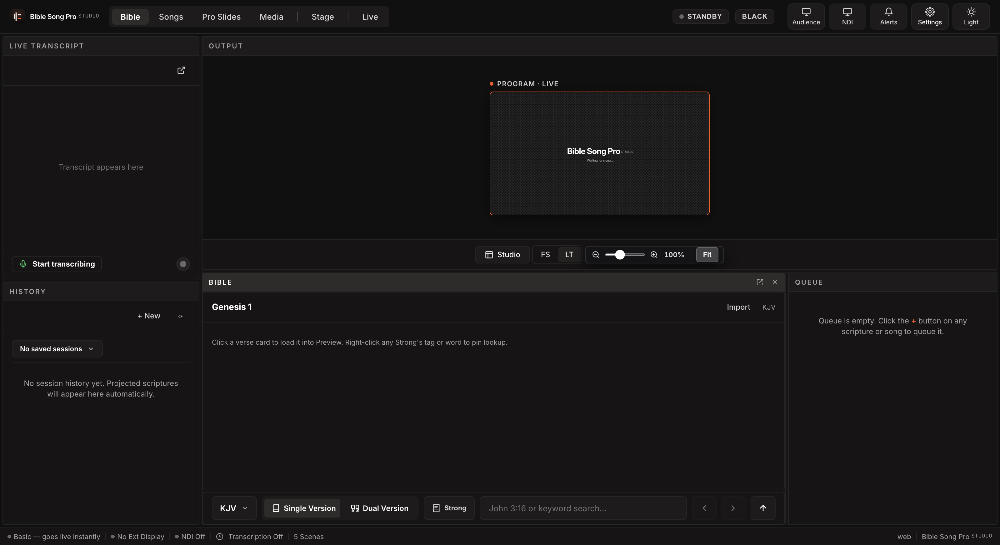
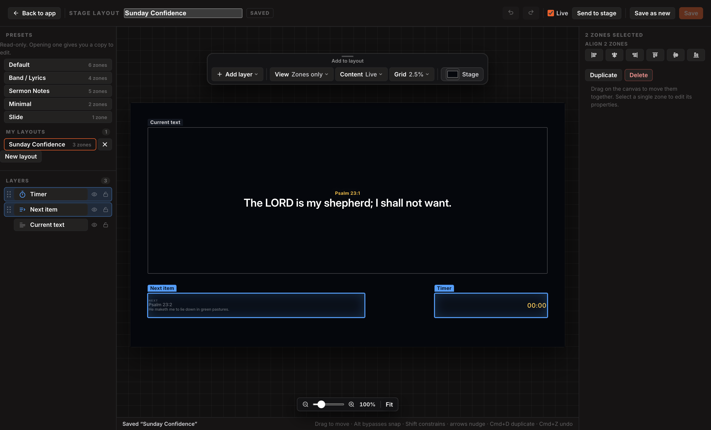
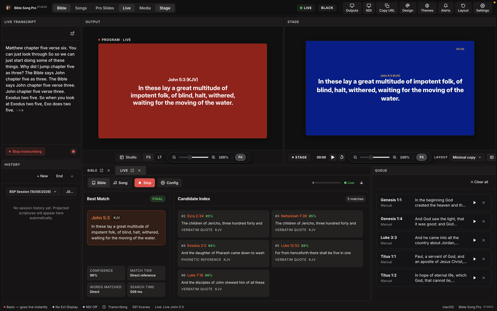

# Bible Song Pro Studio

Bible Song Pro Studio is a professional, high-performance desktop presentation, live scripture detection, and broadcast streaming console built for modern churches, worship teams, and live production environments.

One operator machine drives an audience projector, an on-stage confidence monitor, and an NDI or OBS video feed — seamlessly from a single service plan.

---



---

## 🌟 Key Features

### 🧠 1. AI-Powered Live Speech & Verse Detection
- **Live Voice Recognition**: Transcribes live sermons using local speech models or Deepgram Cloud AI.
- **Automatic Scripture Detection**: Identifies spoken scripture references (`John 3:16`, `Psalm 23:1`, `Genesis 1:1`) in real-time and displays matching verses instantly on screen.
- **Verbatim & Semantic Matching**: High-accuracy verse identification across all major translations.

### 🏛️ 2. Original Languages Word Study (Greek & Hebrew)
- **Root Word Analysis**: Detects Greek and Hebrew root words during live sermon delivery.
- **Concordance & Definitions**: Highlights Strong's concordance numbers, transliterations, and deep original language word definitions for enhanced biblical context.

### 🎨 3. Custom Slide Designer & Presentation Canvas
- **Drag-and-Drop Canvas Editor**: Full visual slide designer with 27+ editable properties, custom shapes (circles, rectangles, stars, triangles), custom fonts, and zero-width border controls.
- **Dynamic Lower-Thirds & Overlays**: Broadcast-quality lower-thirds, customizable themes, and lyrics presentation.
- **Song Arrangement Engine**: Automatic verse/chorus section clustering, OpenLyrics, and ChordPro support.



### 🪟 4. Stackable Dockable Windows & Workspaces
- **Customizable Studio Layout**: Fully lockable, stackable, and rearrangeable UI panels.
- **Multi-Monitor Projection**: Dedicated Audience Display, Stage Display, and Remote Web Control interfaces.
- **Workspace Memory**: Save, export, and load custom window arrangements tailored for worship leaders, media operators, and streaming engineers.



### 🌐 5. Universal 227-Language Bible Engine
- **250 to 1,000+ Bible XML Support**: Import USFX, OSIS, XML Bible translations smoothly.
- **Native Localized 66-Book Names**: Displays book names in native regional languages (`创世记`, `Jẹ́nefísì`, `Genèse`, `Génesis`) instead of fallback English names.
- **Dynamic Header Synchronization**: Instant header updates when switching translations live.

### 📡 6. NDI Broadcast & Remote Streaming
- **Native NDI Output**: Stream program surfaces directly to OBS Studio, vMix, and hardware vision mixers.
- **Remote Web Console**: Web-based mobile and tablet remote control for worship leaders and pastors.

### 🔄 7. In-App Automatic Updates & Maintenance
- **Automatic Release Check**: Instant in-app update notifications when a new release is published.
- **Complete Factory Reset**: One-click library, user Bibles, and settings wipe for clean maintenance.

---

## 📦 Downloads & Releases

Official v3.0.0 production installers are available on the [GitHub Releases Page](https://github.com/Johnbatey/bible-song-pro-studio/releases/tag/v3.0.0):

- **Mac (Apple Silicon M1/M2/M3/M4)**: `Bible Song Pro Studio-3.0.0-arm64.dmg`
- **Mac (Intel)**: `Bible Song Pro Studio-3.0.0-x64.dmg`
- **Mac (Universal)**: `Bible Song Pro Studio-3.0.0-universal.dmg`
- **Windows**: `Bible Song Pro Studio Setup 3.0.0.exe`
- **Linux (AppImage)**: `Bible Song Pro Studio-3.0.0.AppImage`
- **Linux (Debian/Ubuntu)**: `bible-song-pro-studio_3.0.0_amd64.deb`

---

## 🚀 Getting Started

### Installation & Development

```bash
# Clone the repository
git clone https://github.com/Johnbatey/bible-song-pro-studio.git
cd bible-song-pro-studio

# Install dependencies
npm install

# Install pre-commit verification hooks
node scripts/install-hooks.cjs

# Start the application
npm start
```

---

## 🛠️ Building Installers

```bash
# Apple Silicon Mac (arm64)
npm run build:mac

# Intel Mac (x64)
npm run build:mac:intel

# Universal Mac (arm64 + x64)
npm run build:mac:universal

# Windows Installer (NSIS .exe)
npm run build:win

# Linux Installer (.AppImage / .deb)
npm run build:linux
```

All generated binaries land in the `release/` directory.

---

## ✅ Automated Verification

Run the full end-to-end verification suite across bibles, fonts, media, slide parity, and live scripture parsing:

```bash
npm run verify:all
```

| Verification Script | Description |
|---|---|
| `npm run typecheck` | Full TypeScript type check (`tsc --noEmit`) |
| `npm run verify:bibles` | Verifies 66-book canon and licensing compliance |
| `npm run verify:media` | Validates media library indexing & Range requests |
| `npm run verify:slide-parity` | Validates 27 editable slide properties against reference engine |
| `npm run test:live-scripture` | Validates spoken & written scripture parsing fixtures |
| `npm run verify:display-all` | Full display pipeline & window architecture check |

---

## 📜 License

Bible Song Pro Studio is open-source software licensed under the **GPL-3.0-or-later** license. Created by **Johnson Olakotan**.
